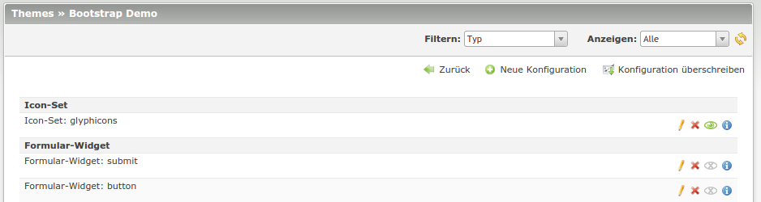

Core
====

Die Core Komponente ist das Herzstück der Contao-Bootstrap Erweiterung, auch wenn viele der Funktionen für den Benutzer
nicht sichtbar sind. Daher setzen alle weiteren Komponenten die Installation des Cores voraus.

Installation
------------

.. code-block:: javascript

    {
        "require": {
            "contao-bootstrap/core": "~1.0"
        }
    }

Konfiguration
-------------

Contao-Bootstrap ist eine flexible Erweiterung, die viele, teilweise versteckte Konfigurationsmöglichkeiten bietet. Sie
kommt jedoch mit einer Standard-Konfiguration, sodass für viele Fälle keine Anpassung der Konfiguration erforderlich
ist.

Die Konfiguration erfolgt (historisch bedingt) an zwei Stellen. Zum einem kann man unter
*Systemeinstellungen > Bootstrap* globale Konfigurationen vornehmen. Der Core bietet hier die Wahl des Iconsets an.
Zum anderen kann für das erstellte Theme themespezifische Anpassungen vorgenommen werden
(*Themes > Bootstrap Konfiguration*).

Funktionen
----------

Bootstrap-Layout
****************

Contao-Bootstrap setzt auf das Layout-Konzept von Contao auf und führt einen Layouttyp ein. Da einige Funktionen
dynamisch im Hintergrund ausgeführt werden, besitzen Sie so die Kontrolle, wann diese Funktionen greifen.

.. figure:: img/core_layouttype.png
   :alt: Layouttyp

   Durch den Layouttyp *Bootstrap* werden Funktionen der Bootstrap-Erweiterung aktiviert.

Konfigurationssystem
********************

Contao-Bootstrap arbeitet mit einem eigenen Konfigurationssystem. Mit diesem lassen sich viele Funktionen aktivieren,
deaktivieren sowie modifizieren. Ein Bestandteil des Systems ist die Backend-Konfiguration. Diese wird von einigen
Komponenten genutzt um verschiedene *Konfigurations-Typen* anzubieten.

Konfigurationstypen
+++++++++++++++++++

Durch den modularen Aufbau von Contao-Bootstrap hängt die zur Verfügung stehenden Konfigurationsmöglichkeiten von den
installierten Komponenten ab. Jeder Typ kann im Backend mehrfach angelegt werden. Nur die aktivierten Einstellungen
greifen dann auch. Die Konfigurationstypen unterscheiden sich zwischen:

 * **Lokale Konfiguration** gilt nur in Layouts des übergeordneten Themes.
 * **Globale Konfiguration** gilt in der gesamten Contao-Installation.

Konfiguration anpassen
++++++++++++++++++++++

Bei der Verwaltung der Konfiguration wird zwischen *Neue Konfiguration anlegen* und *Konfiguration überschreiben*
unterschieden.

 * **Neue Konfiguration anlegen** ist dafür konzipiert um noch nicht konfigurierte Funktionen in das System zu
   integrieren. Dies sind in erster Linie neue *Iconsets*, können aber beispielsweise auch unkonfigurierte Formular-
   Widgets sein.

 * Mit **Konfiguration überschreiben** kann die bereits bestehende Konfiguration überschrieben und erweiteret werden. Da
   Contao-Bootstrap bereits vorkonfiguriert ist, ist dies wohl die gängige Variante. Beim Überschreiben einer
   Konfiguration, werden die bestehenden Einstellungen importiert.

   Als Teil der Themes wird die Bootstrap-Konfiguration im Backend verwaltet.

.. note::
   Globale Konfigurationstypen beeinflussen die gesamte Installation und können daher ungewollte Auswirkungen auf andere
   Themes haben. Daher zeigt Contao-Bootstrap einen Warnhinweis im Backend an.

Icon-Sets
*********

`Bootstrap 3`_ unterstützt von Haus aus die `Glyphicons`_. Contao-Bootstrap bietet daher die Unterstützung von
Icons-Sets an. Dabei ist die Unterstützung offen gehalten, sodass weitere Icons genutzt werden können. Im Kochbuch ist
die Integration eigener Iconsets beschrieben: :doc:`/cookbook/iconsets`.

Icons können innerhalb der Contao-Bootstrap Erweiterung unterschiedlich verwendet werden.

 * Auswahl über den `Icon-Wizard`_ durch Elemente mit direkten Icon-Support
 * Verwendung des Icon-Insert-Tags *{{icon::icon-name}}*. Das HTML-Markup wird automatisch generiert. Der Insert-Tag ist
   somit der ideale Helfer um Icons in Eingabefelder ohne HTML Unterstützung oder im TinyMce unterzubringen.

.. tip::
   Die Contao Erweiterung `netzmacht/contao-font-awesome`_ integriert nahtlos in Contao-Bootstrap.

Für Entwickler
--------------

Ressourcen
----------

.. _Bootstrap 3: http://getbootstrap.com
.. _Glyphicons: http://getbootstrap.com/components/#glyphicons
.. _netzmacht/contao-font-awesome: https://github.com/netzmacht/contao-font-awesome
.. _Icon-Wizard: https://github.com/netzmacht/contao-icon-wizard
