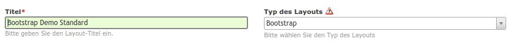

Core
====

Die Core Komponente ist das Herzstück der Contao-Bootstrap Erweiterung, auch wenn viele der Funktionen für den Benutzer
nicht sichtbar sind. Daher setzen alle weiteren Komponenten die Installation des Cores voraus.

Installation
------------

.. code-block:: javascript

    {
        "require": {
            "contao-bootstrap/core": "~1.0"
        }
    }

Funktionen
----------

Bootstrap-Layout
****************

Contao-Bootstrap setzt auf das Layout-Konzept von Contao auf und führt einen Layouttyp ein. Da einige Funktionen
dynamisch im Hintergrund ausgeführt werden, besitzen Sie so die Kontrolle, wann diese Funktionen greifen.

   Durch den Layouttyp *Bootstrap* werden Funktionen der Bootstrap-Erweiterung aktiviert.

Die Konfiguration
*****************

Icon-Sets
*********

Für Entwickler
--------------

Ressourcen
----------
