Grid-Editor
===========

Installation
------------

.. code-block:: javascript

    {
        "require": {
            "contao-bootstrap/grid-editor": "~1.0"
        }
    }

Funktionen
----------

Mit Hilfe des Grid-Editors kann man verschiedene Spaltenlayouts konfigurieren. Diese Spaltenlayouts können dann mit Hilfe der Contao Erweiterungen 
semantic_html5_ oder subcolumns_ auf Inhalte,  wie beispielsweise Artikel oder Formulare, angewendet werden. In diesem Zusammenhang spricht man auch von einem Grid System.
Das Bootstrap Grid besteht standardmäßig aus 12 Spalten die man individuell für jeden Viewport konfigurieren kann.

Einen guten Überblick über den Aufbau des Bootstrap Grid findet man  auf der Webseite getbootstrap.com_.

Aufgerufen wird der Grit Editor über das Backendmodul **Spaltensets**. Dieses befindet sich unter dem Menüpunkt Layout.

.. _semantic_html5: https://contao.org/de/erweiterungsliste/view/semantic_html5.de.html 
.. _subcolumns: https://contao.org/de/erweiterungsliste/view/subcolumns.de.html 
.. _getbootstrap.com: http://getbootstrap.com/css/#grid-options 

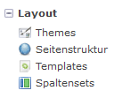

Erstellung eines Spaltensets mit 3 Spalten für verschieden Viewports
********************************************************************

Über den Grit Editor soll ein Spaltenlayout mit folgenden Anforderungen erstellt werden:

 * Bei mittlerer und großer Auflösung (Notebook und PC) soll der Inhalt über 3 Spalten ausgegeben werden.
 * Bei Geräten mit kleiner Auflösung (Tablet)	soll der Inhalt in 2 Spalten ausgegegeben werden.
 * Bei Geräten mit extra kleinen Auflösung (Smartphone) soll der Inhalt jeweils in einer Spalte ausgegeben werden.

Wie schon erwähnt besteht das Bootstrap Grid standardmäßig aus 12 Spalten.
Eine Spalte welche sich über die gesamte Breite der Webseite erstrecken soll wäre also 12 Einheiten breit.
Zwei gleich große Spalten wären dann jeweils 6 Einheiten breit (6+6=12).
Möchte man 3 Spalten mit gleicher Breite darstellen wird das ganze mathematisch nicht viel schwieriger, die Spaltenbreite beträgt 4 (4+4+4=12).

Bei den Einheiten handelt es sich immer um Prozentangeben. Spaltenbreite 12 entspricht 100%,  Spaltenbreite 6 entspricht 50 %, Spaltenbreite 4 entspricht 33.3333% usw.

Über den Spaltenabstand kann man den Abstand links der Spalte definieren. Dabei sollte man aber beachten daß die Summe der Spaltenbreite und des Spaltenabstands 12 ergibt.

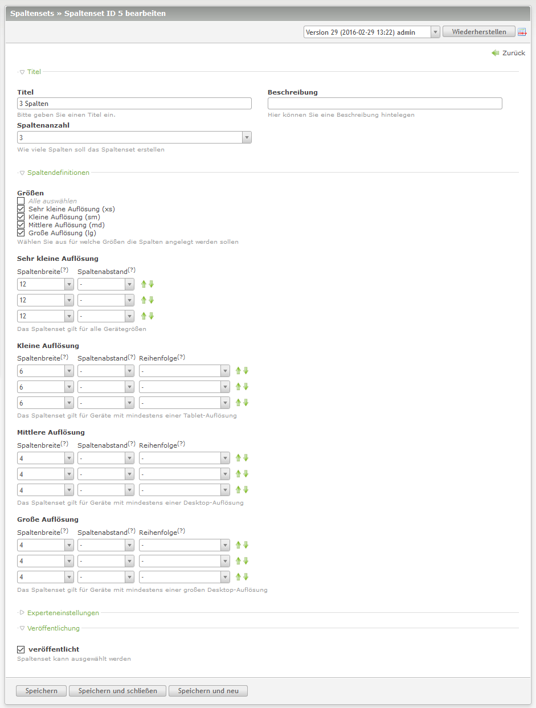
   

Nachdem man ein Spaltenset definiert hat, kann man es mit Hilfe der Contao Erweiterung semantic_html5_ oder subcolumns_ anwenden.

Verwendung eines Spaltensets mit sematic_html5
**********************************************

Um beispielsweise einen Artikel, bestehend aus 3 Spalten mit Hilfe von semantic_html5_ zu erstellen geht man wie folgt vor:

Unter Artikel fügt man als erstes ein Element vom Typ **HTML5-Element** hinzu. Als HTML5 Element verwendet man am besten div.
Unter **Bootstrap Grid-Element verwenden** wählt man **Zeile(row)** aus und selektiert das zuvor erstellte Spaltenset.

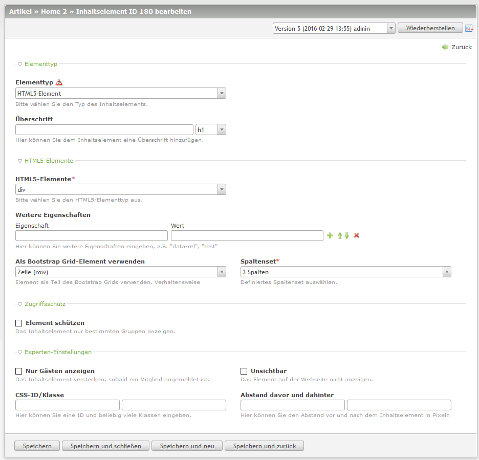
   

Dadurch wird ein div Container mit der Bootstrap Klasse row erzeugt.

Innerhalb des div Containers wird als nächstes ein weiteres Element von Typ **HTML5-Element** erzeugt.
Unter **Bootstrap Grid-Element verwenden**  wählt man jetzt Spalte und es wird automatisch das Feld **Zugeordnetes Grid-Element** ausgewählt.

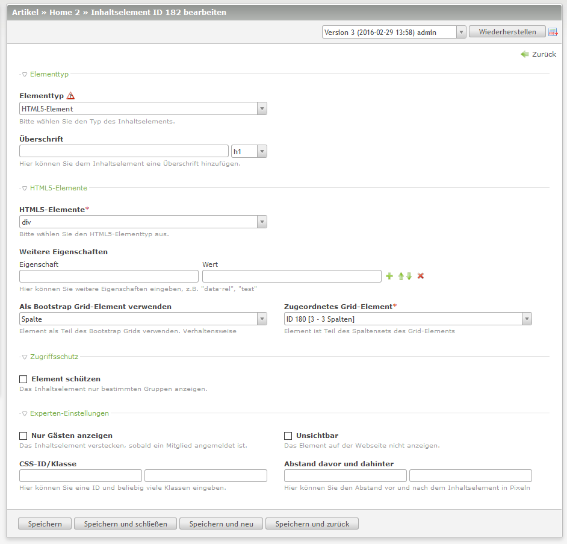
   

Folgende verschachtelte DIV Container sind entstanden:

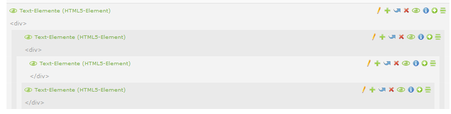
   

Im inneren DIV Container wird anschließend der Inhalt der ersten Spalte erstellt.
Für den Inhalt der zweiten Spalte benötigt man anschließend wieder einen DIV Container vom Typ **HTML5-Element**  als **Bootstrap Grid-Element Spalte**.

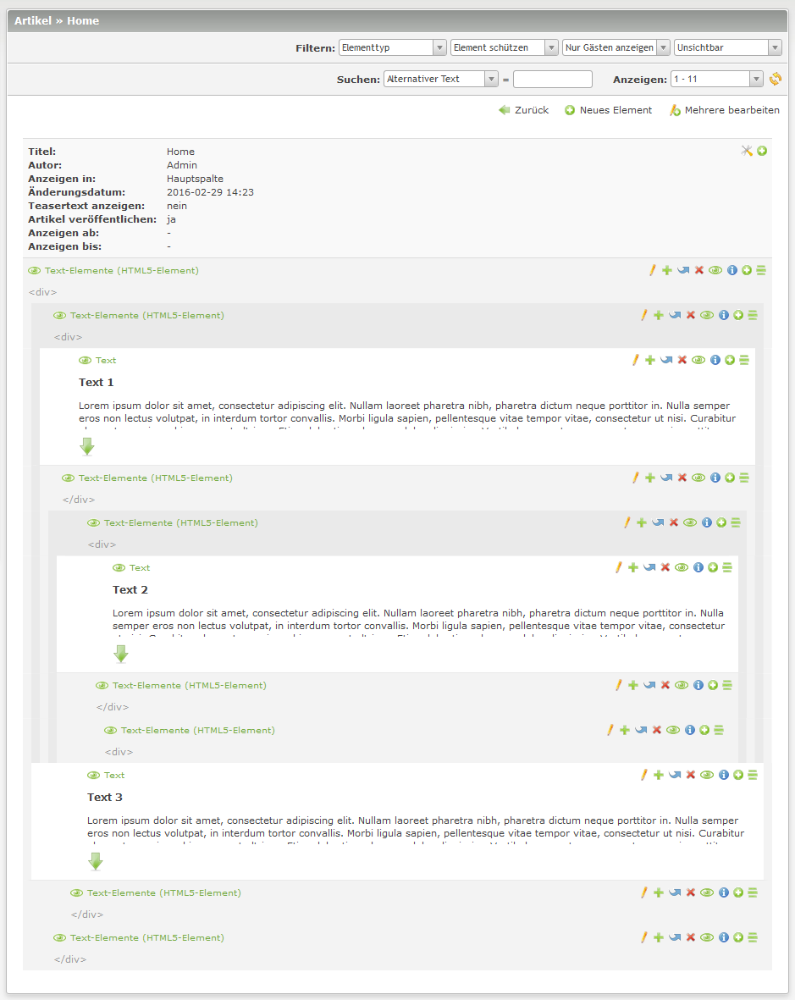
   
   
   
Die Ausgabe auf den verschiedenen Viewports im Frontend stellt sich dann so dar:

Ausgabe bei Viewport Medium und Large (Desktop):

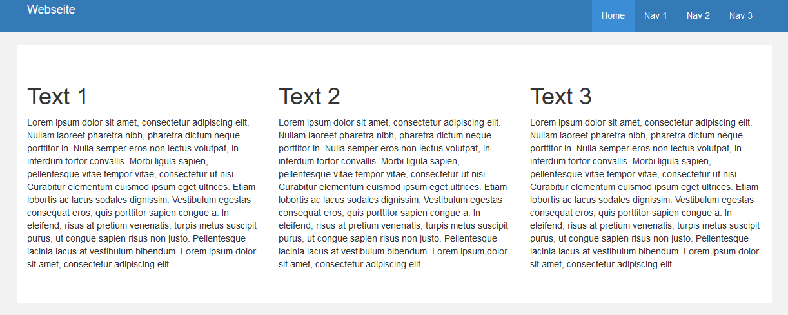

 
Ausgabe bei Viewport Small (Tablet):

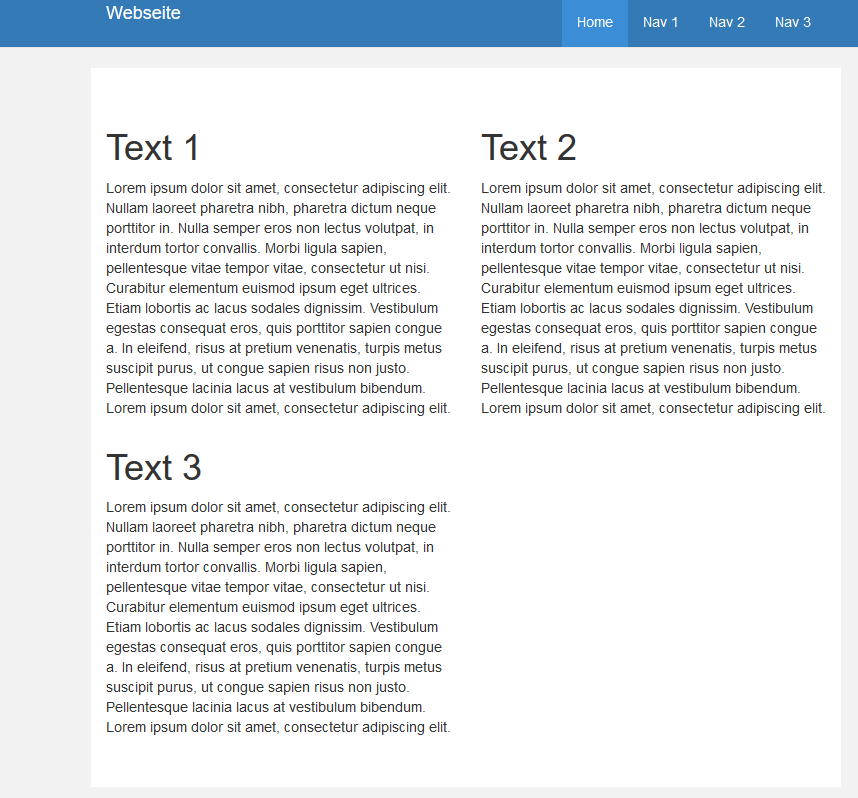

 
Ausgabe bei Vieport  ExtraSmall (Phone):

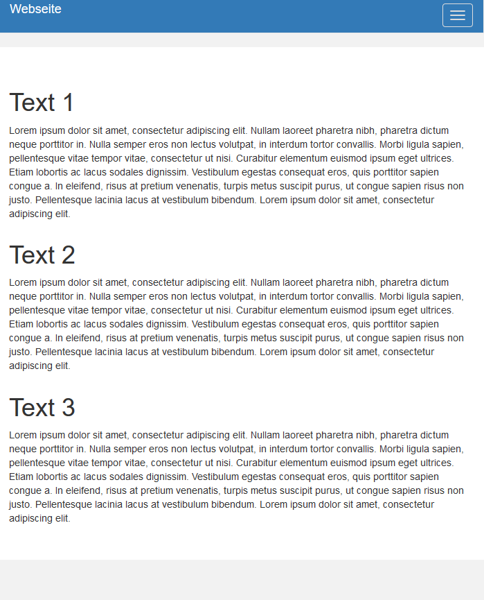

Verwendung eines Spaltensets mit subcolumns und Formularen
**********************************************************

Im folgenden sollen die Formularelemnte eines einfachen Formulars in Abhängigkeit der verschiednen Displaygrößen in Spalten dargestellt werden.

 * Auf Smartphones und Tablets sollen die Formularelemente in einer Spalte dargestellt werden.
 * Bei Geräten mit großen und sehr großen Displays sollen die Formularfelder in zwei Spalten nebeneinander dargestellt werden.

Dazu erstellt man ein Spaltenset mit zwei Spalten:

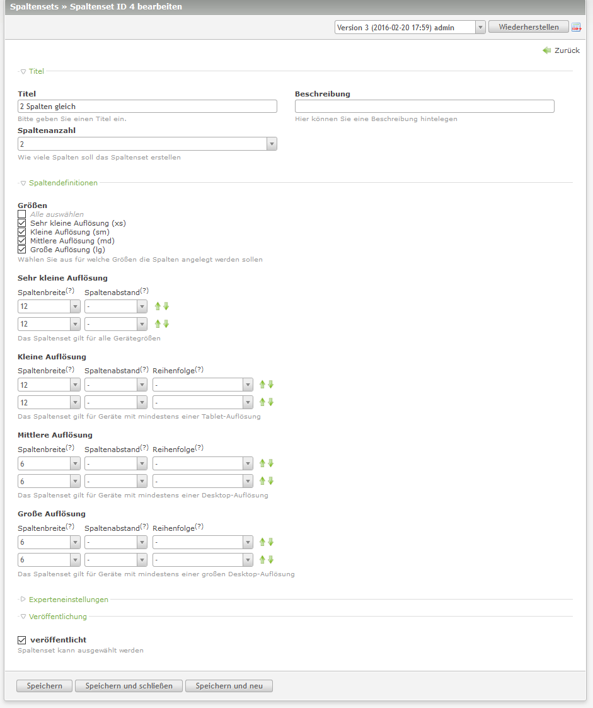
   

Anschließend wechselt man in den Formulargenerator und fügt im enstprechenden Formular einen neuen Feldtyp **Spaltenset Startelement** vor dem ersten Formularelement ein.
Im Auswahlfeld "Unterspalten" wählt man 2 aus. Anschließend kann man unter Spaltenset das zuvor erstellte Spaltenset auswählen.

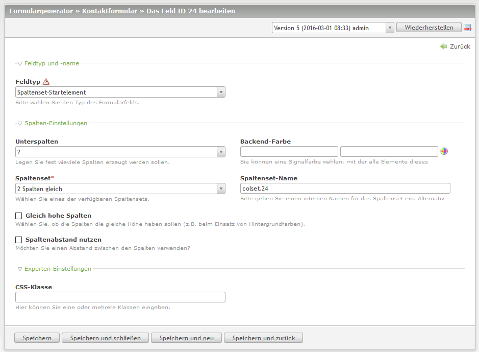
   

Es werden automatisch 3 Formularelemente erstellt:
 * Spaltenset-Startelement
 * Spaltenset-Trennelement
 * Spaltenset-Endelement 

Als nächstes verschiebt man die Formularelemente welche in der linken Spalte plaziert werden sollen, zwischen den **Spaltenset-Startelement** und den **Spaltenset-Trennelement**.
Formularelemente welche in der rechten Spalte plaziert werden sollen verschiebt man zwischen das **Spaltenset-Trennelement** und den **Spaltenset-Endelement**.

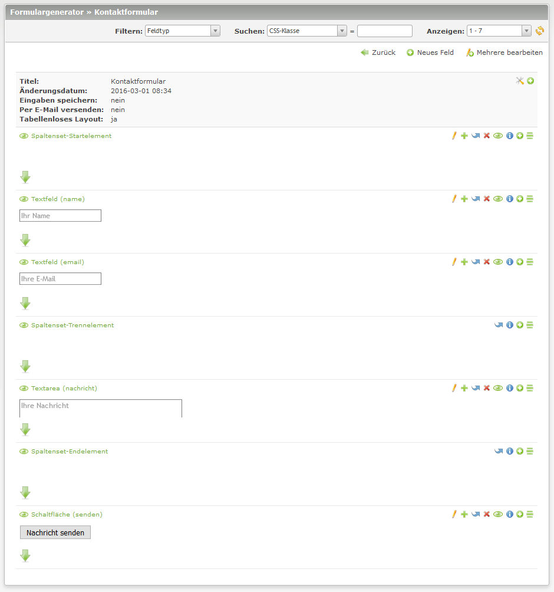

Die Ausgabe auf den verschiedenen Viewports im Frontend stellt sich dann so dar:

Ausgabe bei Viewport Medium und Large (Desktop):

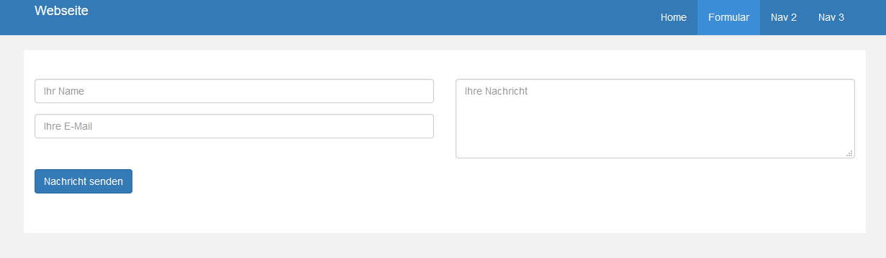

 
Ausgabe bei Viewport Small (Tablet):

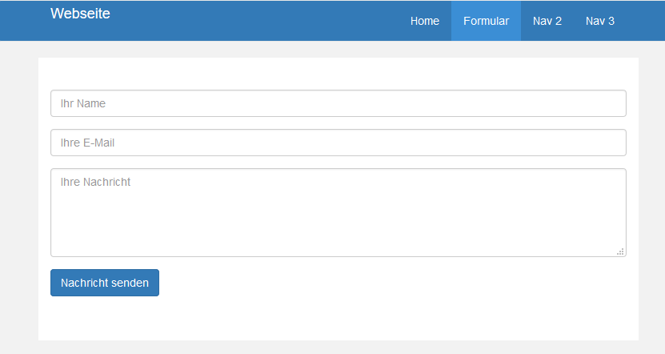

 
Ausgabe bei Vieport  ExtraSmall (Phone):

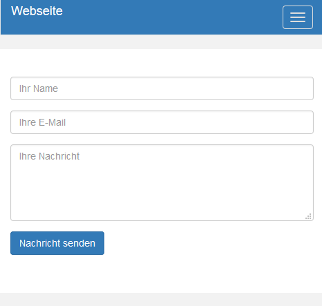

Änderung der Spaltenreihenfolge 
********************************

Bei der Konfiguration von Spaltensets gibt es noch die Konfigurationsmöglichkeit **Reihenfolge**.
Über diesen Punkt kann man die Reihenfolge der Spalten individuell für jeden Vieport gestalten.

Ein Beipiel:

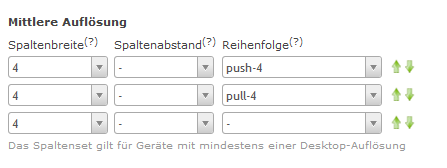

Dadurch wird im Frontend für den Viewport Mittlere Auflösung (md) der Inhalt der zweiten Spalte mit der ersten Spalte getauscht.
(Spalte 1 wird 4 Einheiten nach rechts gepusht, Spalte 2 wird 4 Einheiten nach links gepullt.)

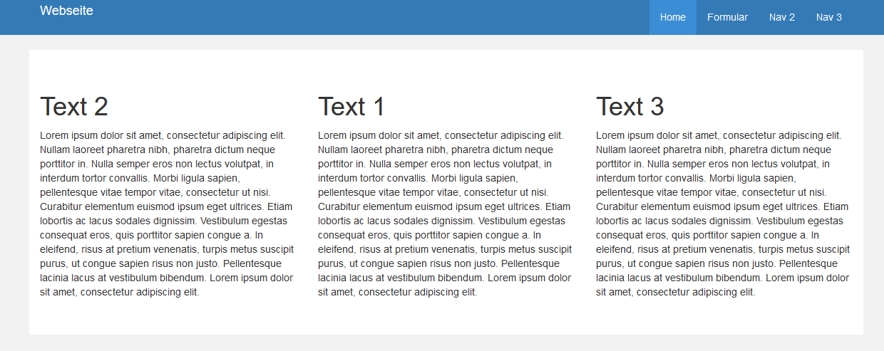
   

Bei allen anderen Viewports hat sich die Reihenfolge nicht verändert.

 
Für Entwickler
--------------

.. hint:: Dieser Bereich ist noch nicht dokumentiert. Für die Dokumentation werden `Unterstützer gesucht`_. Du kannst an
   der `Dokumentation mitarbeiten`_ oder durch eine `finanzielle Unterstützung`_ zur Vervollständigung der Dokumentation
   beitragen.

Ressourcen
----------

.. hint:: Dieser Bereich ist noch nicht dokumentiert. Für die Dokumentation werden `Unterstützer gesucht`_. Du kannst an
   der `Dokumentation mitarbeiten`_ oder durch eine `finanzielle Unterstützung`_ zur Vervollständigung der Dokumentation
   beitragen.

.. _`Unterstützer gesucht`: https://community.contao.org/de/showthread.php?55822-Contao-Bootstrap-Dokumentation
.. _`Dokumentation mitarbeiten`: https://github.com/contao-bootstrap/docs
.. _`finanzielle Unterstützung`: http://contao-bootstrap.netzmacht.de/unterstuetzen.html
